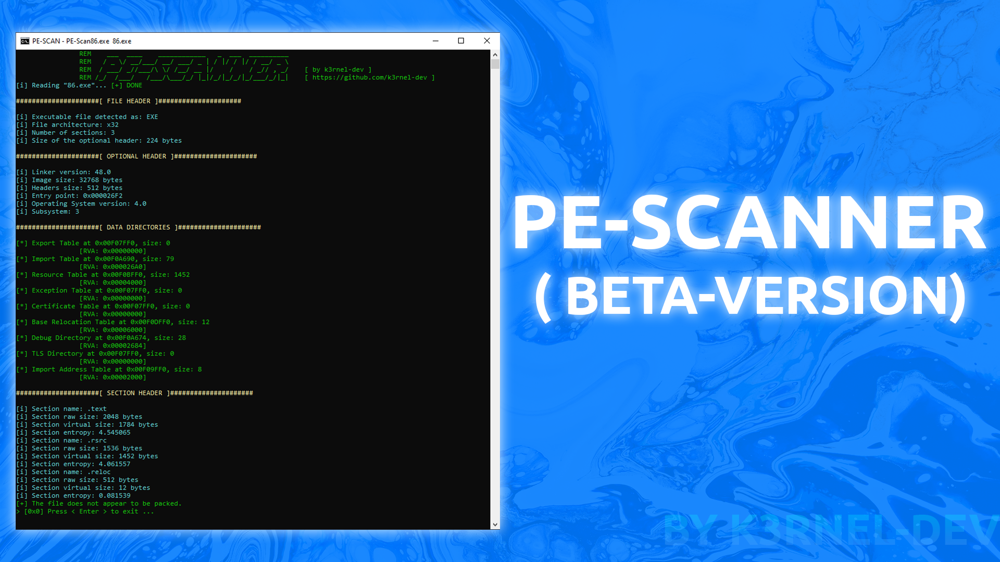
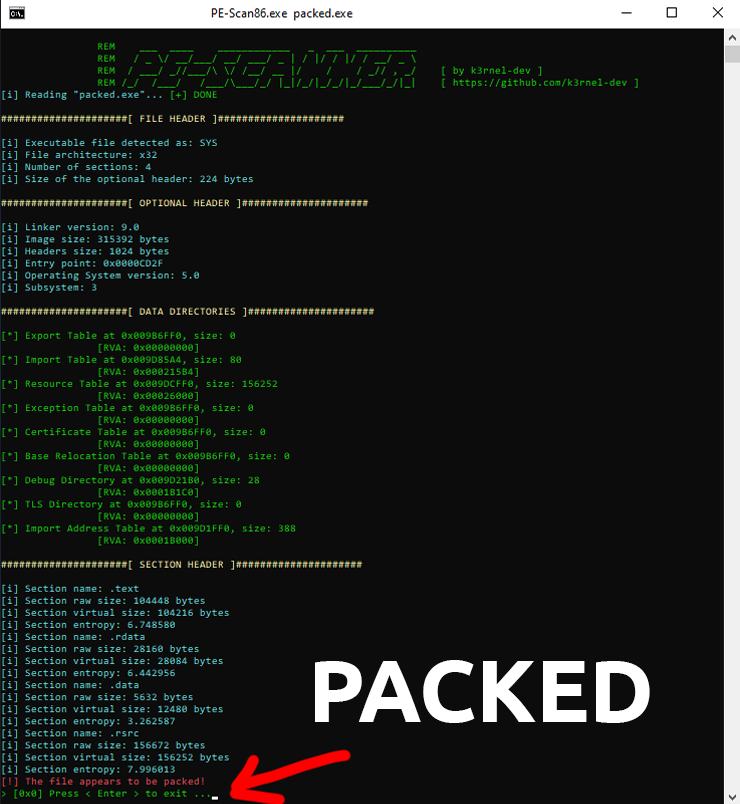
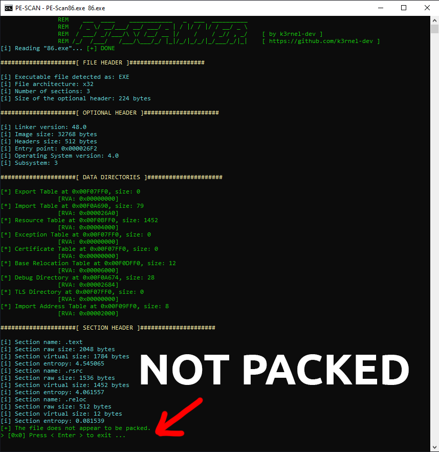

# PE Scanner ( beta-version )



## 👋 About - Welcome:
```
PE Scanner is a tool for analyzing PE (Portable Executable) files on the Windows platform. It allows reading, parsing, and analyzing PE files, providing information about headers, sections, and their characteristics. Additionally, PE Scanner can evaluate the entropy of sections, which helps in determining if a file is packed.
```
## 🏴‍☠️ Features:
- **Read PE Files**: Open and read PE files from disk.
- **Parse PE Headers**: Extract and display information from the DOS header, NT headers, and section headers.
- **Calculate Entropy**: Calculate the entropy of each section to detect packed sections.
- **Output to File**: Optionally, write the parsed information to an output file.

## 👤 Usage:

```cmd
PEScanner.exe <path_to_pe_file> [-w output_file.txt]
```

## 📷 Review Result:



## Author:
```
Developed by k3rnel-dev.
```
